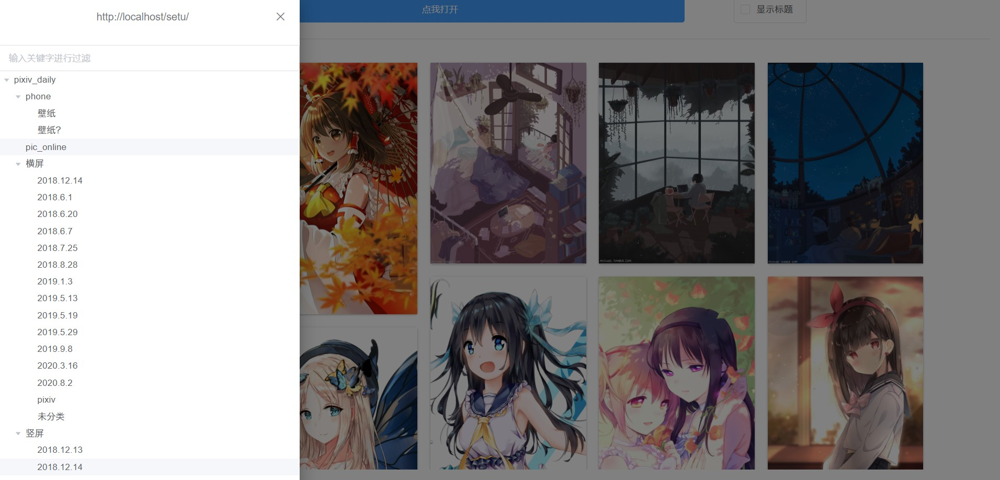
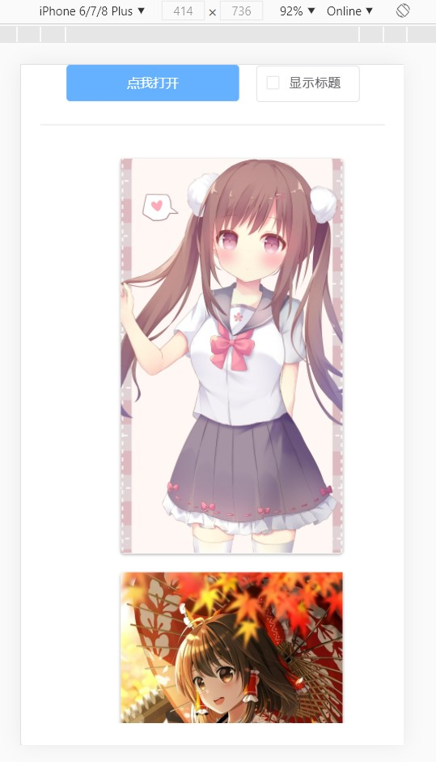

# pic_online
> Front for pic_online  

- Enjoy yourself with your images everywhere

* Front: [pic_online](https://github.com/IITII/pic_online)
* Backend: [pic_online_backend](https://github.com/IITII/pic_online_backend)
### Preview
* PC


* ipad

* mobile

### Project setup
```
npm install
```

### Compiles and hot-reloads for development
```
npm serve
```

### Compiles and minifies for production
```
npm build
```

### Lints and fixes files
```
npm lint
```

### Project structure
```
.
├── dist            // build dir
│   └── pic
├── public          // public dir
│   └── pic
└── src             // source files
    ├── assets      // Resource file dir
    ├── components  // Vue components
    ├── plugins     // Vue Plugins
    ├── routes      // Vue routers
    ├── utils       // basic function
    └── views       // Vue views
```
### Config

> See: https://cli.vuejs.org/zh/guide/deployment.html  

|   Param    |                                        Default                                        |             Description             |
| :--------: | :-----------------------------------------------------------------------------------: | :---------------------------------: |
| publicPath | `process.env.NODE_ENV === 'production'? process.env.PIC_DEPLOY_FIR or '/pic/' : '/',` | deploy dir, `root dir` or `sub-dir` |
| outputDir  |                       `process.env.PIC_OUTPUT_DIR or './dist'`                        |          build output dir           |


> Configure axios's request url  

* Default

```js
const op = {
  baseURL: "http://127.0.0.1:3000/",
  timeout: 5000,
  timeoutErrorMessage: 'timeout',
  proxy: null,
};
const pic_axios = axios.create(op);
```

1. modify `baseURL` `./src/App.vue#55` as you want
2. Re-build dist, run: `npm build`

### Roadmap

* Support draggable button.
* Configure axios request url on web page.
* Save user configure to cookies.
* Using `vuex` to save scrollbar status.
* Emit the loading event before bottom equals zero.
* Add drawer width when using mobile phone.
* Support horizontal scroll for the drawer.

### Known issues

1. image display will be terrible when mobile phone rotating frequently.
2. Memory usage will be larger and larger until browser panic because of all images is load in memory.
3. drawer width will be to narrow to see `full node name` when using mobile phone