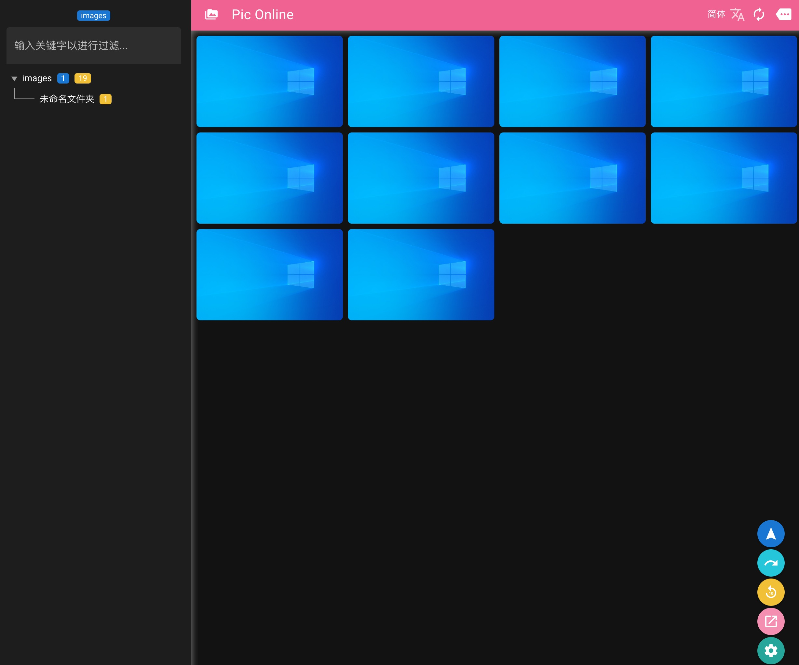
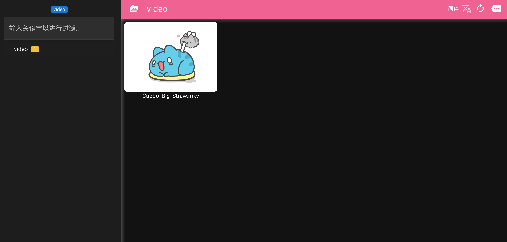
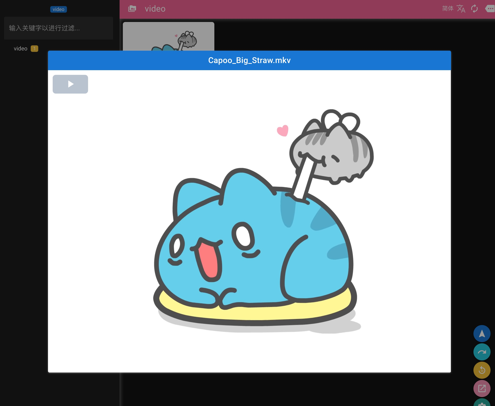

# Pic Online (pic_online_front)

## 用途

* 局域网媒体服务, 可用于图片浏览, 漫画阅读, 播放 nas 视频等...

- [tg 聚合机器人](https://github.com/IITII/tg_setu_bot)
- [图片压缩工具](https://github.com/IITII/pic_minify)
- [Telegraf 下载器](https://github.com/IITII/telegraph_downloader)
- [zfile 同步工具](https://github.com/IITII/zfile_sync)
- [PicOnline 后端](https://github.com/IITII/pic_online_backend)

## 大体功能

> 文件树性能优化, 对大量文件夹和文件的情况进行了定向优化

* 自适应浏览器和手机窗口
* 支持瀑布流, 图片懒加载
* 支持窗口大小变化时, 自动对图片布局进行调整
* 支持多语言
* 支持暗黑模式自动切换
* 支持视频观看
* 支持热键切换
* 支持状态持久化, 自动定位至上次浏览文件夹
* 文件数少时, 自动监听底层文件变化, 自动重新扫描
* 文件数多时, 支持手动重新扫描底层文件, 刷新即可重新获取文件列表
* 文件树展开优化, 默认展开当前目录及父节点, 其他节点自动折叠

## 预览

### 手机截图

### 桌面截图





## 部署

* release 版本
  * `pic_online.zip`: 必须放在网站 `根目录` 下, 不能放在子目录下
  * `pic_online_pic.zip`: 必须放在网站子目录 `/pic` 下
* gh-pages 分支版本, 必须放在网站子目录 `/pic_online` 下

* [局域网媒体浏览服务搭建](./build.md)

## 热键

### viewer 打开时
> https://github.com/fengyuanchen/viewerjs#keyboard-support

* Esc: 退出全屏或者关闭查看器或者退出 `modal mode` 或者停止播放
* Space: 停止播放.
* Tab: 切换 viewer 的 button 焦点.
* Enter: 在焦点的 button 上面触发点击操作.
* ←: 上一张.
* →: 下一张.
* ↑: 放大图片.
* ↓: 缩小图片.
* Ctrl + 0: 重置缩放.
* Ctrl + 1: 放大/缩小到图片的原始大小.

### 播放器打开时

* Space: 暂停/开始 播放
* f / Enter / Ctrl Enter: 全屏/退出全屏
* ←: 播放进度-5s
* →: 播放进度+5s
* ↑: 音量 +0.1
* ↓: 音量 -0.1
* z: 重置播放速度 1.0
* x: 播放速度 -0.05
* c: 播放速度 +0.1

## Know issues

### 图片 CORS 问题

* 注释 `node_modules/vue-waterfall-plugin-next/dist/my-lib.es.js:340` 行
* 第三方插件问题
* https://github.com/heikaimu/vue3-waterfall-plugin/issues/13

### 服务页面 node 和 service 页不可用

* 应该是升级到 Vue3 引发的问题, 数据正常加载, table 无数据, 未解决


## To be continue...

## dev

### Install dependencies

```bash
npm install
```

### Start the app in development mode (hot-code reloading, error reporting, etc.)

```bash
quasar dev
```

### Lint the files

```bash
npm run lint
```

### Build the app for production

```bash
quasar build
```

### Customize the configuration

See [Configuring quasar.conf.js](https://v1.quasar.dev/quasar-cli/quasar-conf-js).
